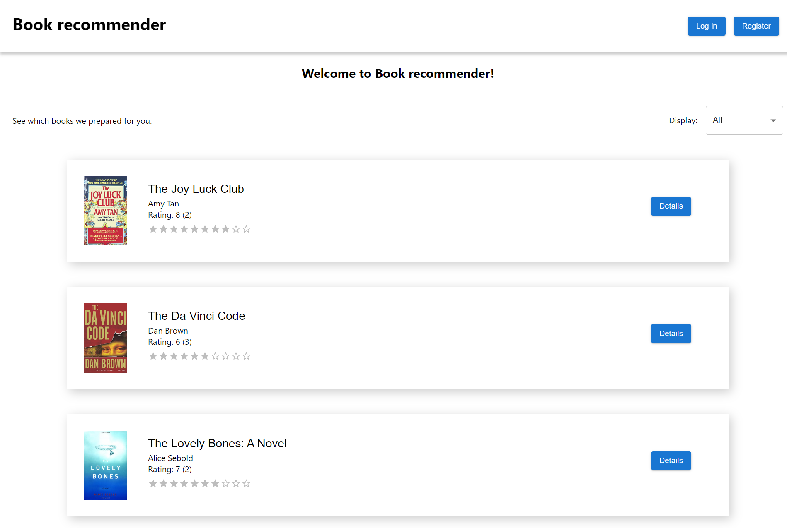
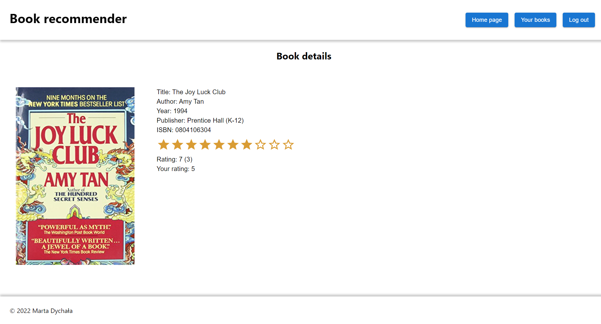
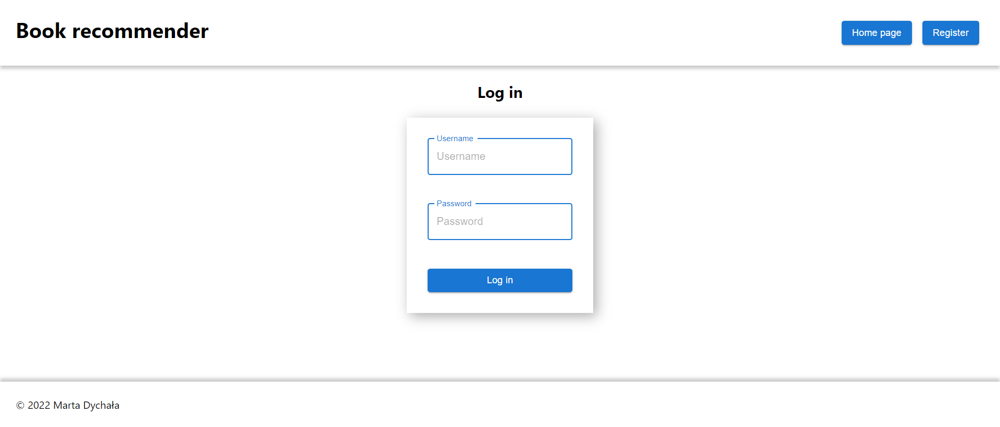
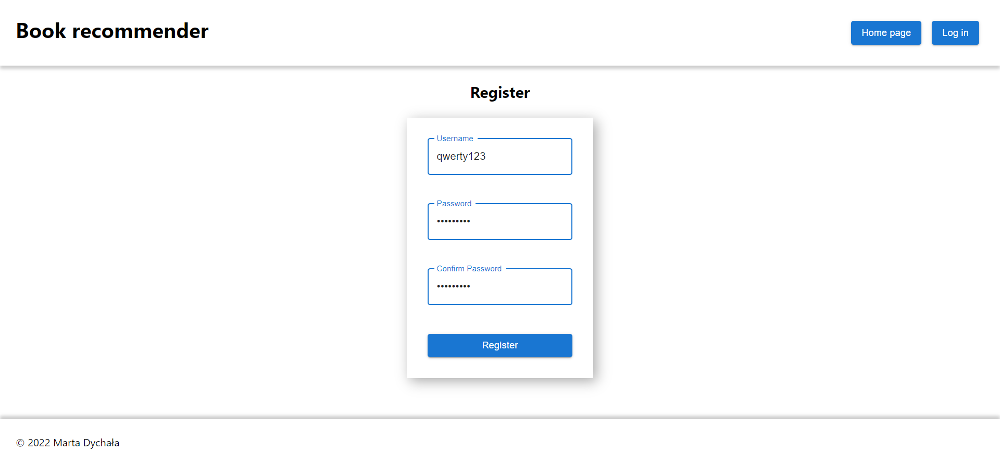
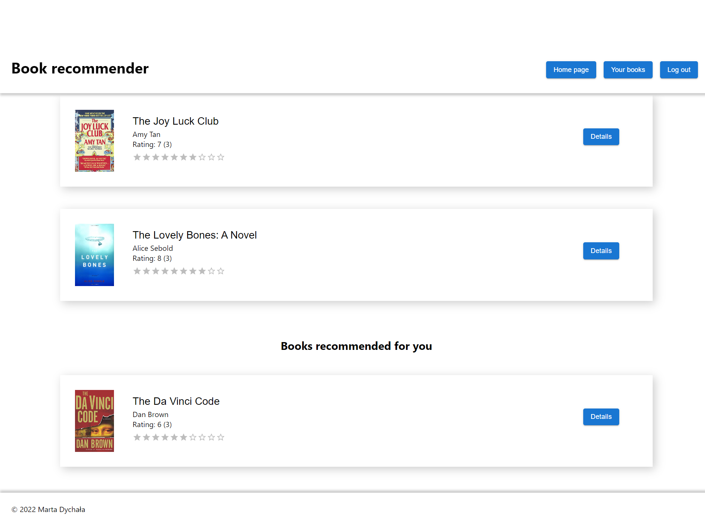
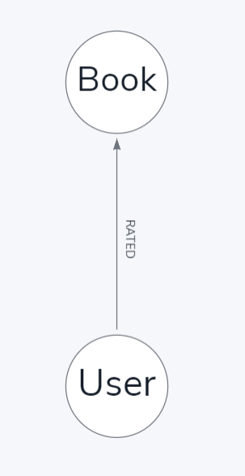
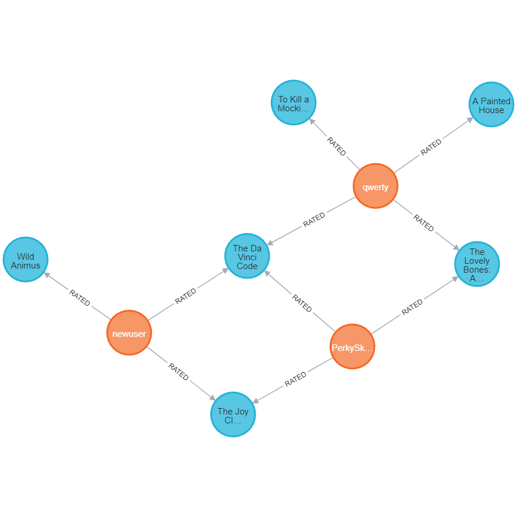
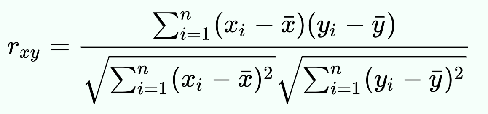

# Book recommender

## Marta Dychała

---

## I. Cel projektu

> W ramach zajęć należy wykonać jeden projekt typu "proof of concept" wykorzystujący grafową bazę danych Neo4J z interfejsem dostępu do bazy wykonanym w ramach dowolnej technologii internetowej ( aplikacja typu SPA, aplikacja oparta o technologię MVC lub wykorzystująca RESTful i AJAX ).
> Do realizacji projektu można wykorzytać dowolne środowisko udostępniające rozwiązania chmurowe ( AWS, IBM Cloud, Microsoft Azure czy Heroku). W ramach projektu można wykorzystać bazę danych Neo4J dostępną w ramach usługi DBaaS w serwisie Neo4J AuraDB.

## II. Temat projektu

Tematem projektu jest system rekomendacji książek, do którego utworzenia wykorzystano grafową
bazę danych Neo4J. W projekcie tym można manipulować zawartością grafowej bazy danych poprzez dodawanie użytkowników i ocen.

## III. Funkcjonalności projektu

W ramach aplikacji dla każdego z użytkowników udostępnione są następujące funkcjonalności:

- rejestracja do serwisu
- logowanie do serwisu
- przeglądanie wszystkich książek z bazy
- przeglądanie popularnych książek (z największą liczbą ocen)
- przeglądanie najwyżej ocenionych książek
- wyświetlenie szczegółowych informacji o książce (tytuł, autor, wydawnictwo, rok wydania, okładka książki, ocena)

Ponadto dla zalogowanego użytkownika udostępnione są dodatkowe funkcjonalności:

- ocenianie książek (dodawanie oceny, zmiana oceny)
- przeglądanie ocenionych książek
- wyświetlanie rekomendowanych książek na stronie głównej oraz profilu użytkownika

## IV. Struktura projektu

Projekt składa się z dwóch aplikacji - klienta (_frontend_) oraz serwera (_backend_). Obydwie aplikacje
zostały napisane w całości w języku TypeScript.

### a) Aplikacja klienta

Do napisania aplikacji po stronie klienta
wykorzystano bibliotekę React oraz framework Next.js.

Strona główna:



Na stronie głównej można wyświetlić wszystkie książki znajdujące się w bazie. Za pomocą listy rozwijanej
można kontrolować jaka grupa książek ma się wyświetlać (wszystkie, popularne, najwyżej ocenione, polecane)


Strona z informacjami o książce:



Strona logowania:



Strona rejestracji:



Profil użytkownika:



### b) Aplikacja serwera

Aplikacja, która bezpośrednio komunikuje się z bazą danych Neo4j, została napisana w Node.js z wykorzystaniem
frameworku Express.js. Udostępnia ona poniższe endpointy:
#### Autoryzacja

- **[POST]** `/auth/register` - rejestracja użytkownika
- **[POST]** `/auth/login` - logowanie użytkownika
- **[POST]** `/auth/logout` - wylogowanie użytkownika

#### Informacje o użytkowniku

- **[GET]** `/users/` - lista wszytkich użytkowników
- **[GET]** `/users/:username` - informacje o użytkowniku z podaną nazwą użytkownika

#### Książki

- **[GET]** `/books/` - lista wszystkich książki wraz z średnią oceną i liczbą ocen
- **[GET]** `/books/popular` - lista popularnych książek
- **[GET]** `/books/highestRated` - lista najwyżej ocenionych książek
- **[GET]** `/books/:id` - informacje o książce o podanym id (ISBN)
- **[GET]** `/books/:id/:username/rating` - ocena książki o podanym id wystawiona przez użytkownika o podanej nazwie użytkownika
- **[GET]** `/books/user/:username` - książki ocenione przez użytkownika o podanym nicku
- **[GET]** `/books/user/:username/recommended` - lista książek rekomendowanych użytkownikowi
- **[POST]** `/books/user/:username/rate`- dodanie oceny książce o podanym id przez użytkownika o nicku `username`

### c) Struktura bazy danych

W bazie danych znajdują się dwa rodzaje węzłów:

- osoba, czyli Użytkownik (User)
- obiekt rekomendowany, czyli Książka (Book)

Węzły **User** oraz **Book** połączone są ze sobą relacją **:RATED** wychodzącą od użytkownika, zaprezentowaną na
rysunku poniżej:



Odpowiada to zapytaniu `(:User)-[:RATED]->(:Book)` w języku Cypher.

Fragment struktury rozłożenia danych w bazie:



Na niebiesko oznaczone są książki, natomiast na pomarańczowo - użytkownicy.

#### Model **User**

```
id:       integer;
username: string;
password: string;
```

#### Model **Book**

```
ISBN:       string;
title:      string;
author:     string;
year:      integer;
publisher:  string;
imageURL:   string;

```

#### Relacja **RATED**

```
ISBN:       string;
userID:     integer;
value:      integer;

```

Dane książek znajdujące się w bazie danych pochodzą ze zbioru danych https://www.kaggle.com/datasets/arashnic/book-recommendation-dataset.

## V. System rekomendacji

System rekomendacji w omawianym projekcie jest zaimplementowany zgodnie z metodą *collaborative-filtering*.

Na początku odszukiwane są oceny innych użytkowników dla książek ocenionych przez użytkownika.
Na podstawie tych danych jest obliczany wskaźnik korelacji Pearsona dla każdego z użytkowników, który stanowi wagę dla danej oceny:  



Następnie dla pozostałych książek, które zostały ocenione przez innych użytkowników obliczana jest 
potencjalna ocena, którą wystawiłby obecny użytkownik zgodnie ze wzorem:

```
Ocena = suma(pearson_i * ocena_i) / suma(pearson_i) 
```

Tak otrzymane oceny są następne sortowane w kolejności malejącej. W ten sposób najwyżej na
liście rekomendacji znajduje się książka, którą użytkownik oceniłby najwyżej.

## VI. Wdrożenie aplikacji

Aplikacja po stronie klienta została wdrożona w serwisie Vercel, który rozwija framework Next.js.
Aplikację po stronie serwera umieszczono w serwisie Render. W obydwu przypadkach zdecydowano się na
te platformy w związku z możliwością darmowego hostingu na tychże serwisach.

## VII. Linki do aplikacji

Aplikacja po stronie klienta dostępna jest pod adresem: https://book-recommendation-seven.vercel.app/

Aplikację serwera wdrożono pod adresem: https://bookrecommender-2kdl.onrender.com/

### Dane do testowania:

**Nazwa użytkownika**: TestUser12345

**Hasło**: password
